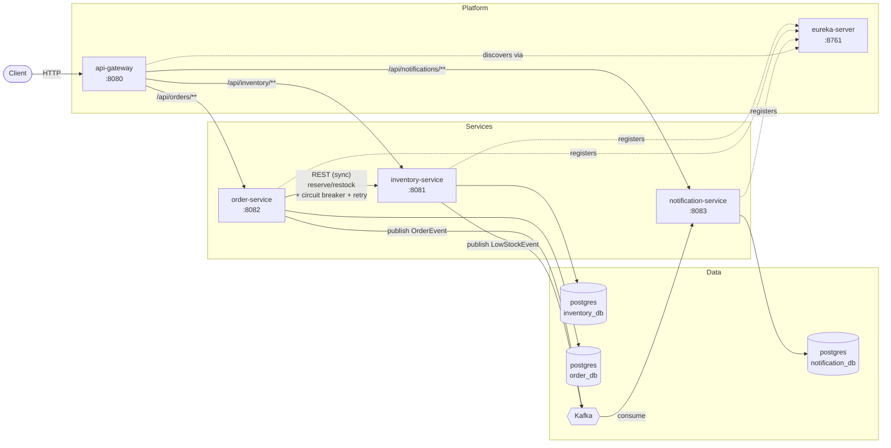

# IMS - Inventory Management System

A small but realistic *microservices* Inventory Management System built in Java 17 / Spring Boot 3. It demonstrates the core building blocks of resilient service-to-service communication: service discovery, an API gateway, synchronous calls guarded by circuit-breaker/retry/timeout, asynchronous event-driven communication via Kafka, idempotency, optimistic locking, and a manual saga with compensation.

## Contents

- [Architecture](#architecture)
- [Services](#services)
- [Design & resilience concepts demonstrated](#design--resilience-concepts-demonstrated)
- [Bugs found and fixed through load testing](#bugs-found-and-fixed-through-load-testing)
- [Running it](#running-it)
- [API walkthrough](#api-walkthrough)
- [Testing](#testing)
- [Project layout](#project-layout)

## Architecture



Every service is an independent Spring Boot app with its **own database** ("database per
service") and registers itself with **Eureka** on startup. External traffic enters through
a single **API Gateway**, which resolves `lb://<service-name>` routes dynamically via
Eureka instead of hard-coded hosts - so any service can scale to N instances transparently.

Two different communication styles are used deliberately, to show when each is
appropriate:

- **Synchronous REST** (`order-service` → `inventory-service`) for the one call that
  needs an immediate, consistent answer: "is there stock, and did we just reserve it?"
  This path is wrapped in resilience patterns (see below) because a synchronous call is
  a synchronous *dependency* - if inventory-service is slow or down, that has to be
  handled explicitly instead of cascading.
- **Asynchronous events over Kafka** (`order-service`/`inventory-service` → Kafka →
  `notification-service`) for side effects that don't need to happen before the request
  completes. Order placement never blocks on, or fails because of, notification delivery.

## Services

| Service | Port | Responsibility |
|---|---|---|
| `eureka-server` | 8761 | Service registry; every other service registers here and discovers peers by logical name. |
| `api-gateway` | 8080 | Single public entry point; routes `/api/inventory/**`, `/api/orders/**`, `/api/notifications/**` to the right service via Eureka. |
| `inventory-service` | 8081 | Owns product/stock data. Exposes CRUD for products, a `reserve` endpoint used by order-service, and a `restock` endpoint. Publishes `LowStockEvent`. |
| `order-service` | 8082 | Places orders. Calls inventory-service synchronously to reserve stock per line item, runs a compensating saga on partial failure, publishes `OrderEvent`. |
| `notification-service` | 8083 | Consumes `OrderEvent` / `LowStockEvent` from Kafka and "sends" (logs + persists) notifications. Exposes read-only history. |

## Design & resilience concepts demonstrated

This is the part most relevant to an interview conversation - each of these is a small,
inspectable piece of code, not a framework default left untouched.

**1. Service discovery + API gateway** (`eureka-server`, `api-gateway`)
Services register under a logical name; the gateway and Feign clients resolve that name
through Eureka and client-side load-balance. No service hard-codes another's host:port.

**2. Circuit breaker + retry + timeout on the sync call** (`order-service`)
`InventoryClientAdapter` wraps the Feign call to inventory-service with Resilience4j
`@Retry` (bounded retries with exponential backoff) and `@CircuitBreaker` (fails fast once
the failure rate trips, instead of piling up threads waiting on a struggling dependency).
Feign itself has tight connect/read timeouts so a hung call doesn't block indefinitely.
See `order-service/src/main/java/com/ims/order/client/InventoryClientAdapter.java` and the
`resilience4j.*` block in its `application.yml`.

**3. Don't retry business errors** (`order-service`)
A custom `ErrorDecoder` (`InventoryFeignErrorDecoder`) turns inventory-service's 409
(insufficient stock) and 404 (unknown SKU) into specific local exceptions, which are then
configured as `ignore-exceptions` for both the retry and circuit breaker. Retrying "you
don't have enough stock" is pointless and would also unfairly count against the circuit
breaker's health metric for inventory-service.

**4. Idempotency** (`inventory-service`)
`reserve` requires an `idempotencyKey`. Every attempt is logged in a `stock_reservations`
table keyed by that value; a repeated call with the same key (e.g. because order-service's
retry logic fired *after* the first call had actually already succeeded server-side, but
the response was lost) replays the stored result instead of double-decrementing stock.

**5. Optimistic locking under concurrency** (`inventory-service`)
`Product` has a `@Version` column. Two concurrent reservations against the same SKU will
make one of them fail to commit; `ProductServiceImpl` retries that specific
read-check-write cycle a bounded number of times rather than either overselling stock or
losing an update. (Note the write itself lives in a separate `@Transactional` bean,
`StockReservationExecutor` - calling an `@Transactional` method on `this` from inside the
same class bypasses Spring's proxy, a classic gotcha this code avoids on purpose.)

**6. Saga with compensation instead of a distributed transaction** (`order-service`)
An order can have multiple line items, each requiring a separate call to
inventory-service. There's no two-phase commit across services. Instead,
`OrderServiceImpl` reserves items one at a time; if any item fails (business rejection or
inventory-service being unavailable), it compensates by calling `restock` for whichever
earlier items in the same order were already reserved, then marks the order `REJECTED` or
`FAILED` accordingly. The order row is persisted in `PENDING` *before* any remote calls, so
there's always a durable record of the attempt even if the process crashes mid-saga.

**7. Event-driven decoupling + Kafka consumer resilience** (`notification-service`)
`order-events` and `low-stock-events` are consumed independently of the producers'
lifecycle. Consumer deserialization is wrapped in `ErrorHandlingDeserializer`, and a
`DefaultErrorHandler` retries a failing message a couple of times before routing it to a
`<topic>.DLT` dead-letter topic - so one poison-pill message can't wedge a partition
forever or be silently swallowed.

**8. Graceful degradation over hard failure** (`order-service`)
`POST /api/orders` always returns `201` with the persisted order - the *placement* of the
order (accepting and durably recording it) is a separate concern from whether it could be
*fulfilled* right now. The response's `status`/`failureReason` fields communicate the
outcome, which is friendlier to a caller than a `503` that throws away the fact the order
was received at all.

**9. Database-per-service + explicit, duplicated contracts**
Each service owns its schema; nothing reaches across a database boundary. The DTOs
order-service uses to talk to inventory-service (`client/dto/*`) are deliberately
hand-duplicated rather than shared via a common library, trading a bit of manual
synchronization for true independent deployability of the two services.

## Bugs found and fixed through load testing

This system was stress-tested under concurrency and failure conditions, not just
demoed happy-path. Two real issues surfaced during testing, and both were fixed and
re-verified with controlled experiments rather than assumed fixed:

**1. Idempotency race condition (`inventory-service`)**
Firing 10 concurrent requests with the same idempotency key revealed that all 10
could pass the "does this key already exist?" check before any of them had
committed — a classic check-then-act race. One request won and inserted
successfully; the other 9 hit an unhandled database unique-constraint violation
(Postgres `23505`) and returned a raw `500` instead of a clean replayed result.

Fixed by catching the constraint violation specifically, re-querying the
reservation table, and returning the winning request's result — with a short
bounded retry to cover the edge case where the winner's transaction hasn't
committed yet. Verified with 3 separate concurrent load test runs (10 simultaneous
duplicate requests each): 30/30 requests returned clean `200`s, stock decremented
correctly every time.

**2. Circuit breaker fallback bug (`order-service`)**
With `inventory-service` stopped, the circuit breaker correctly tripped `OPEN`
(confirmed via `actuator/health` state transitions), but requests were still
taking ~940ms each — not the near-instant fail expected once a breaker is open.
Root cause: the fallback method was catching the breaker's rejection and
re-throwing it as a different exception type, which the retry logic didn't
recognize as "already handled" — so it retried anyway, paying the full backoff
delay for no reason.

An initial hypothesis (a second, competing circuit breaker from Spring Cloud
OpenFeign layered on top of Resilience4j's) was tested and ruled out — both
configurations gave statistically indistinguishable latency (~940ms either way).
The actual fix was adding the fallback's exception type to retry's
`ignore-exceptions`. Verified via controlled experiments (3 runs × 10 requests,
circuit-open state confirmed via actuator before each run): latency dropped from
~940ms to ~40–80ms, with zero overlap between any before/after measurement.


## Running it

### Option A: Docker Compose (everything, one command)

Requires Docker Desktop.

```bash
docker compose up --build
```

This brings up Zookeeper, Kafka, three Postgres instances (one per service),
`eureka-server`, `api-gateway`, and all three business services, wired together with
health-check-gated startup ordering. First build takes a few minutes (each service image
compiles with Maven inside a build stage).

Once it's up:

- Eureka dashboard: http://localhost:8761
- API Gateway (use this for all API calls below): http://localhost:8080

### Option B: Run locally with Maven

Useful for iterating on one service at a time.

1. Start infra only: `docker compose up zookeeper kafka postgres-inventory postgres-order postgres-notification`
2. Build everything once: `mvn clean install -DskipTests`
3. In separate terminals: `mvn spring-boot:run -pl eureka-server`, then `-pl api-gateway`,
   `-pl inventory-service`, `-pl order-service`, `-pl notification-service`.

## API walkthrough

All requests go through the gateway on port 8080.

**Create a product**

```bash
curl -X POST http://localhost:8080/api/inventory/products \
  -H "Content-Type: application/json" \
  -d '{"sku":"SKU-100","name":"Wireless Mouse","description":"2.4GHz","price":19.99,"quantity":10,"reorderThreshold":3}'
```

**Place an order** (reserves stock synchronously against inventory-service)

```bash
curl -X POST http://localhost:8080/api/orders \
  -H "Content-Type: application/json" \
  -d '{"customerEmail":"buyer@example.com","items":[{"sku":"SKU-100","quantity":8,"unitPrice":19.99}]}'
```

Order this drops `SKU-100` to 2, at/below its `reorderThreshold` of 3 → inventory-service
publishes a `LowStockEvent` → notification-service logs/persists an admin alert.

**Try to over-order** (business rejection, no retry, saga compensates any earlier items)

```bash
curl -X POST http://localhost:8080/api/orders \
  -H "Content-Type: application/json" \
  -d '{"customerEmail":"buyer@example.com","items":[{"sku":"SKU-100","quantity":999,"unitPrice":19.99}]}'
```

Response comes back `201` with `"status":"REJECTED"` and a `failureReason`.

**See what notification-service "sent"**

```bash
curl http://localhost:8080/api/notifications
```

**Simulate inventory-service being down** to see the circuit breaker/fallback in action:
stop the `inventory-service` container (`docker compose stop inventory-service`), then
repeat the "place an order" call a few times - after the configured failure threshold, the
circuit opens and subsequent orders fail fast with `"status":"FAILED"` instead of each one
hanging for the full retry+timeout budget. Check
`http://localhost:8082/actuator/health` (circuit breaker health indicator) to see the
state transition from `CLOSED` → `OPEN` → `HALF_OPEN`.

## Testing

Each service has Mockito-based unit tests for its core business logic (no database or
broker required to run them):

- `inventory-service`: idempotent replay, optimistic-lock retry/exhaustion, insufficient
  stock, low-stock event publishing.
- `order-service`: full success path, business-rejection + compensation, infra-failure +
  compensation, durable "PENDING before remote calls" persistence.
- `notification-service`: event → notification-type mapping.

```bash
mvn test
```

## Project layout

```
IMS/
├── pom.xml                  # parent POM - shared Spring Boot/Cloud dependency versions
├── docker-compose.yml        # full stack: infra + platform + services
├── eureka-server/
├── api-gateway/
├── inventory-service/
│   └── src/main/java/com/ims/inventory/{controller,service,repository,entity,dto,event,exception,config}
├── order-service/
│   └── src/main/java/com/ims/order/{controller,service,repository,entity,dto,client,event,exception,config}
└── notification-service/
    └── src/main/java/com/ims/notification/{controller,service,repository,entity,dto,listener,event,config}
```

