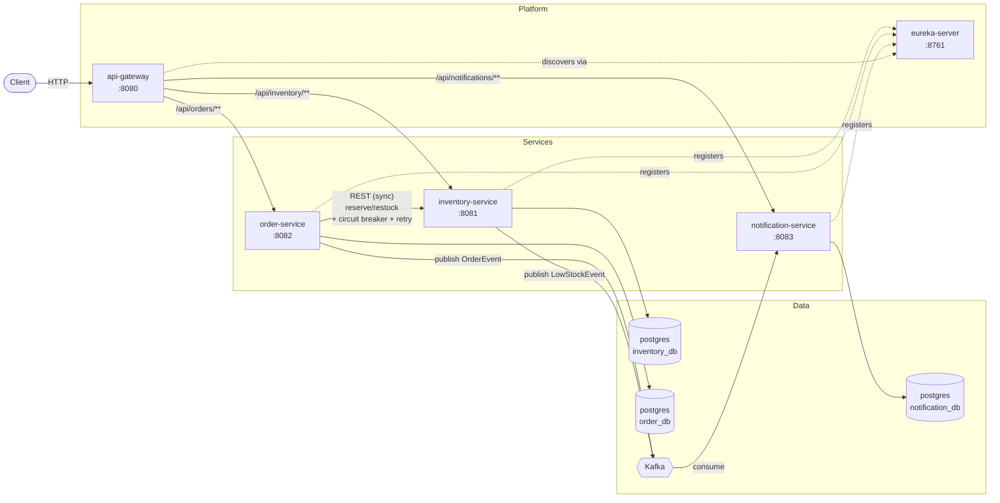

# IMS — Inventory Management System
 
A small microservices system (Java 17, Spring Boot 3) that places orders against
live inventory. Built to demonstrate real service-to-service communication
patterns, not just CRUD behind a REST API.
 
## What it does
 
- Manages products and stock levels (`inventory-service`)
- Places orders that reserve stock in real time (`order-service`)
- Sends notifications on order events and low-stock alerts (`notification-service`)
- Routes all traffic through one gateway, with services found dynamically via
  a service registry — no hard-coded hosts
## Why it's useful
 
Most demo microservice projects show the happy path only. This one shows what
breaks under real conditions, and how the code handles it:
 
- A synchronous call (order → inventory) that must not cascade-fail when the
  dependency is slow or down
- Asynchronous events (Kafka) for side effects that shouldn't block the main request
- Concurrency bugs (double-charging, overselling stock) and how they were found
  and fixed under load, not just assumed away
If you're learning resilience patterns (circuit breaker, retry, idempotency,
optimistic locking, saga/compensation) and want to see them as working code
instead of slideware, this is that.
 
## Architecture
 

```mermaid
flowchart LR
    Client([Client])
 
    subgraph Platform
        GW[api-gateway<br/>:8080]
        EU[eureka-server<br/>:8761]
    end
 
    subgraph Services
        INV[inventory-service<br/>:8081]
        ORD[order-service<br/>:8082]
        NOT[notification-service<br/>:8083]
    end
 
    subgraph Data
        PGI[(postgres<br/>inventory_db)]
        PGO[(postgres<br/>order_db)]
        PGN[(postgres<br/>notification_db)]
        KAFKA{{Kafka}}
    end
 
    Client -->|HTTP| GW
    GW -->|/api/inventory/**| INV
    GW -->|/api/orders/**| ORD
    GW -->|/api/notifications/**| NOT
 
    INV -. registers .-> EU
    ORD -. registers .-> EU
    NOT -. registers .-> EU
    GW -. discovers via .-> EU
 
    ORD -->|"REST (sync)<br/>reserve/restock<br/>+ circuit breaker + retry"| INV
 
    INV --> PGI
    ORD --> PGO
    NOT --> PGN
 
    ORD -->|publish OrderEvent| KAFKA
    INV -->|publish LowStockEvent| KAFKA
    KAFKA -->|consume| NOT
```
 
| Service | Port | Responsibility |
|---|---|---|
| `eureka-server` | 8761 | Service registry |
| `api-gateway` | 8080 | Single entry point, routes by service name |
| `inventory-service` | 8081 | Product/stock data, `reserve`/`restock`, publishes `LowStockEvent` |
| `order-service` | 8082 | Places orders, calls inventory sync, runs saga on partial failure, publishes `OrderEvent` |
| `notification-service` | 8083 | Consumes events from Kafka, logs/persists notifications |
 
Each service has its own database ("database per service"). Nothing reaches
across a DB boundary; the DTOs order-service uses to talk to inventory-service
are hand-duplicated rather than shared, trading manual sync for independent
deployability.
 
**Resilience patterns implemented** (each is real code, not a framework default):
 
- **Circuit breaker + retry + timeout** on the order→inventory call (Resilience4j)
- **No retry on business errors** — a 409 (insufficient stock) or 404 (unknown SKU)
  is not retried and doesn't count against the circuit breaker
- **Idempotency** — `reserve` takes an idempotency key; a repeated call replays
  the original result instead of double-decrementing stock
- **Optimistic locking** — concurrent reservations against the same SKU use a
  `@Version` column with bounded retry, so stock is never oversold or silently lost
- **Saga with compensation** — a multi-item order reserves items one at a time;
  if one fails, already-reserved items are restocked and the order is marked
  `REJECTED`/`FAILED`. The order row is persisted `PENDING` before any remote
  call, so there's always a durable record even if the process crashes mid-saga
- **Graceful degradation** — `POST /api/orders` always returns `201`; whether
  the order could actually be fulfilled is carried in `status`/`failureReason`,
  not a `503` that discards the fact the order was received
- **Kafka consumer resilience** — deserialization errors and poison-pill
  messages route to a `<topic>.DLT` dead-letter topic instead of wedging a
  partition or being silently dropped
## How to run it
 
**Docker Compose (everything, one command)** — requires Docker Desktop:
 
```bash
docker compose up --build
```
 
- Eureka dashboard: http://localhost:8761
- API Gateway (use for all calls): http://localhost:8080
**Run locally with Maven** (for iterating on one service):
 
```bash
docker compose up zookeeper kafka postgres-inventory postgres-order postgres-notification
mvn clean install -DskipTests
mvn spring-boot:run -pl eureka-server
mvn spring-boot:run -pl api-gateway
mvn spring-boot:run -pl inventory-service
mvn spring-boot:run -pl order-service
mvn spring-boot:run -pl notification-service
```
 
**Try it (macOS/Linux/WSL/Git Bash):**
 
```bash
# create a product
curl -X POST http://localhost:8080/api/inventory/products \
  -H "Content-Type: application/json" \
  -d '{"sku":"SKU-100","name":"Wireless Mouse","price":19.99,"quantity":10,"reorderThreshold":3}'
 
# place an order
curl -X POST http://localhost:8080/api/orders \
  -H "Content-Type: application/json" \
  -d '{"customerEmail":"buyer@example.com","items":[{"sku":"SKU-100","quantity":8,"unitPrice":19.99}]}'
```
 
**Try it (Windows, PowerShell):**
 
curl.exe on Windows exists, but PowerShell's quoting rules break the single-quote
JSON body above. Use `Invoke-RestMethod` instead — it's the native equivalent:
 
```powershell
# create a product
Invoke-RestMethod -Method Post -Uri http://localhost:8080/api/inventory/products `
  -ContentType "application/json" `
  -Body '{"sku":"SKU-100","name":"Wireless Mouse","price":19.99,"quantity":10,"reorderThreshold":3}'
 
# place an order
Invoke-RestMethod -Method Post -Uri http://localhost:8080/api/orders `
  -ContentType "application/json" `
  -Body '{"customerEmail":"buyer@example.com","items":[{"sku":"SKU-100","quantity":8,"unitPrice":19.99}]}'
```
 
If you want to use `curl.exe` directly on Windows instead, swap the single
quotes for double quotes and escape the inner double quotes:
 
```cmd
curl.exe -X POST http://localhost:8080/api/inventory/products -H "Content-Type: application/json" -d "{\"sku\":\"SKU-100\",\"name\":\"Wireless Mouse\",\"price\":19.99,\"quantity\":10,\"reorderThreshold\":3}"
```
 
**Then, on any OS:**
 
```bash
# stop inventory-service and repeat the order call to watch the circuit breaker trip
docker compose stop inventory-service
```
 
Run tests (unit tests only, no DB/broker needed):
 
```bash
mvn test
```
 
## Where to get help
 
- Open a GitHub Issue on this repo for bugs or questions
- Check `actuator/health` on the relevant service for live circuit-breaker state
- The `docs/` in each service's package structure (`controller/service/repository/...`)
  maps 1:1 to responsibility, so start in the package matching the symptom
 
## Decisions made, and what I'd change
 
Every project has trade-offs that don't survive contact with the README unless
someone writes them down on purpose.
 
**Bugs found under load, not assumed away**
 
- *Idempotency race*: firing 10 concurrent requests with the same idempotency
  key showed all 10 could pass the "does this key exist?" check before any
  committed. One insert won, 9 hit a raw Postgres `23505` and returned `500`.
  Fixed by catching the constraint violation, re-querying, and returning the
  winner's result with a short bounded retry. Verified: 30/30 clean `200`s
  across 3 runs.
- *Circuit breaker looked open but wasn't fast*: breaker correctly tripped
  `OPEN`, but calls still took ~940ms. Root cause was the fallback re-throwing
  a new exception type that retry didn't recognize as already-handled, so it
  retried anyway. An initial theory — a second competing circuit breaker from
  Spring Cloud OpenFeign — was tested and ruled out (latency was identical
  either way). Fix: add the fallback's exception type to retry's
  `ignore-exceptions`. Verified: latency dropped to ~40–80ms, no overlap with
  pre-fix measurements.

  
**Deliberate trade-offs**
 
- *Duplicated DTOs instead of a shared library between order-service and
  inventory-service.* Costs a bit of manual sync when the contract changes;
  buys true independent deployability. I'd revisit this only if the two
  services started changing their shared contract often enough that drift
  became a real bug source.
- *Manual saga instead of a distributed transaction.* Simpler to reason about
  and debug than 2PC, but compensation logic is hand-written per failure mode.
  This doesn't scale past a handful of steps — a real orchestrator (e.g.
  Temporal, or an outbox-pattern-based saga) would be the next step if order
  flows grew more complex than "reserve N items, roll back on failure."
- *Order placement always returns 201, even on failure to fulfill.* Correct
  API design here, but it pushes an obligation onto every client to check
  `status` — easy to forget. Worth adding a webhook/callback option so
  clients aren't required to poll or inspect the body.
  
  
**What I'd change with more time**
 
- **Single point of failure at the gateway.** Right now there's one
  `api-gateway` instance. If it dies, the whole system is unreachable from
  outside, regardless of how healthy the three business services are. This
  is the biggest gap in the "resilience" story as it stands — everything
  downstream is protected, but the front door isn't.
- **Move to Kubernetes instead of Docker Compose.** Compose is fine for a demo
  running on one machine, but it doesn't restart a crashed container onto a
  healthy node, doesn't do rolling deploys, and doesn't scale a service
  without manual `docker compose up --scale`. K8s gives readiness/liveness
  probes, auto-restart, and horizontal scaling for free — closer to how this
  would actually run in production.
- **Run multiple `api-gateway` replicas behind a load balancer**, instead of
  one instance. In K8s this is close to free: a `Deployment` with
  `replicas: 3` plus a `Service` in front gives you both the multiple
  instances and the load balancing in one move — they're not really two
  separate features to build, just one decision (replica count) plus the
  Service object K8s already gives you. Client-side, Eureka already does
  load balancing across `inventory-service`/`order-service`/
  `notification-service` instances; the gap is specifically that the gateway
  itself was never made redundant the same way.
- Worth being honest about scope here: none of this is needed to demonstrate
  the resilience patterns this project is actually about (circuit breaker,
  idempotency, saga, etc.). It matters if the goal shifts from "show these
  patterns work" to "this could hold production traffic" — those are
  different bars, and right now this project clears the first one, not the
  second.
